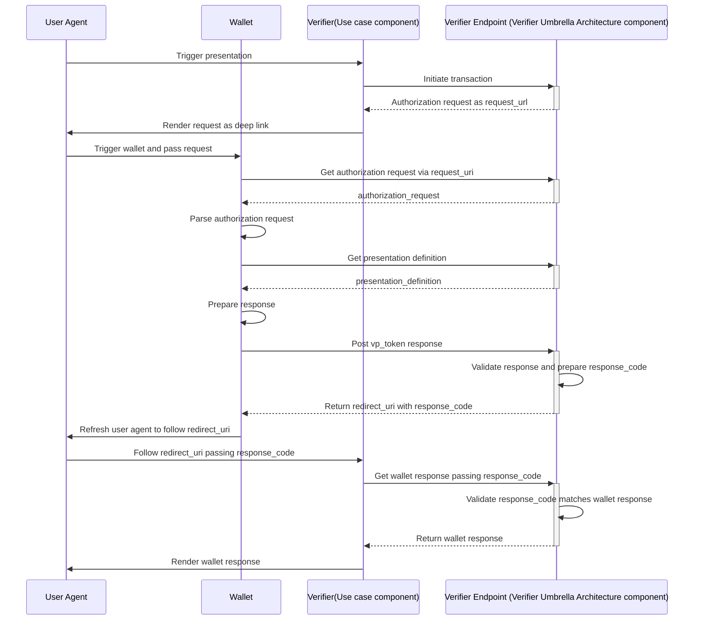
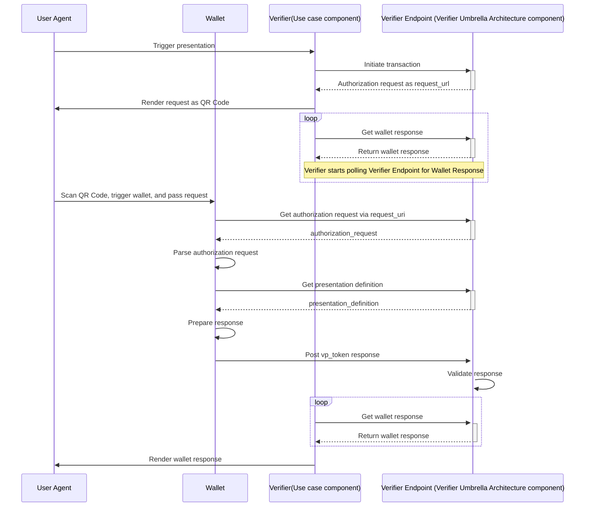

# VERIFIER API

## Table of contents

* [Overview](#overview)
* [Presentation Flows](#presentation-flows)
* [How to build and run](#how-to-build-and-run)
* [Endpoints](#endpoints)
* [Configuration](#configuration)

## Overview

This a Web application (Backend Restful service) that acts as a Verifier/RP trusted end-point.
The Verifier API is based on [OIDC4VP draft version 20](https://openid.net/specs/openid-4-verifiable-presentations-1_0-20.html). The ID Token is also supported according to [SIOPv2](https://openid.github.io/SIOPv2/openid-connect-self-issued-v2-wg-draft.html).  
The following operations are supported:
- `Initialize a presentation`, where Verifier may define whether it wants to request a SIOP (id_token) or OpenID4VP (vp_token).
- `Get Request Object` according JWT Secured Authorization Request.
- `Get Presentation Definition` according to OpenId4VP in case of using presentation_definition_uri.
- `Direct Post` according to OpenID4VP direct_post
- `Get Wallet response`, where Verifier receives depending on the request an id_token, vp_token, or an error.
An Open API v3 specification of these operations is available

**Please note that**
- All APIs should be exposed over HTTPS.
- These endpoints: `Initialize a presentation` and `Get Wallet response`, needs to protected to allow only authorized access. These two endpoints should only be called internally by the Verifier. The wallet is not going to call those endpoints so that public access is not needed for those. 

This library has been used for validating the presentations (https://www.npmjs.com/package/@trace4eu/verifiable-presentation). This source code of this library is [here](../verifiable-presentation).

## Presentation flows

Regarding the `Response Mode`, it is only supported the mode `direct_post`. It is based on this diagram:   
https://openid.net/specs/openid-4-verifiable-presentations-1_0-20.html#name-response-mode-direct_post-2

It means that two flows have been implemented depending on whether the `redirectUri` has been informed when initializing the presentation (see [Endpoints](#endpoints)).  
Not informing the redirectUri could make sense in a cross device flow, and informing it in a same device flow. For that reason we present the two possible scenarios:

### Same device

### Cross device

## How to build and run

## Endpoints

## Configuration
