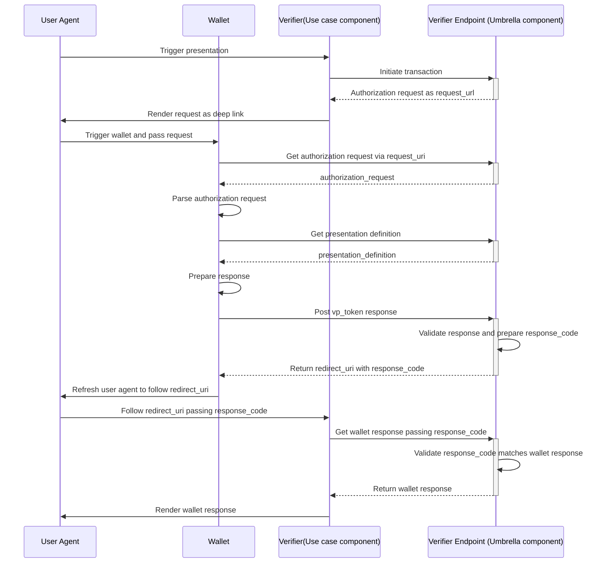
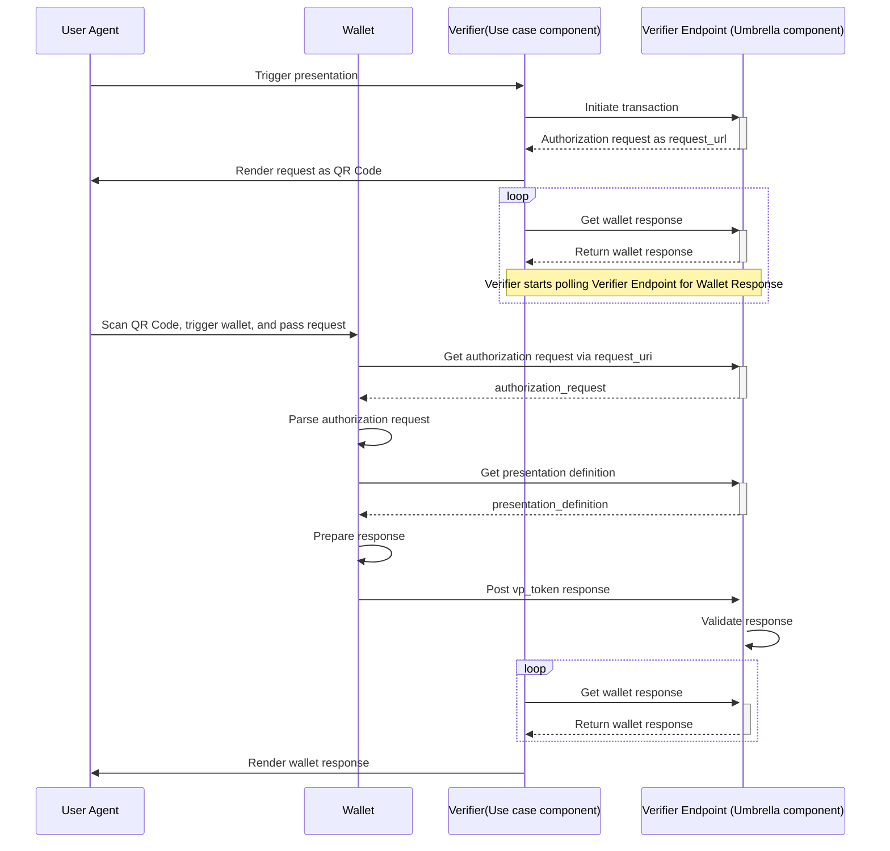

# VERIFIER API

## Table of contents

* [Overview](#overview)
* [Presentation Flows](#presentation-flows)
* [How to build and run](#how-to-build-and-run)
* [Endpoints](#endpoints)
* [Configuration](#configuration)

## Overview

This a Web application (Backend Restful service) that acts as a Verifier/RP trusted end-point.
The Verifier API is based on [OIDC4VP draft version 20](https://openid.net/specs/openid-4-verifiable-presentations-1_0-20.html). The ID Token is also supported according to [SIOPv2](https://openid.github.io/SIOPv2/openid-connect-self-issued-v2-wg-draft.html).  
The following operations are supported:
- `Initialize a presentation`, where Verifier may define whether it wants to request a SIOP (id_token) or OpenID4VP (vp_token) (see [endpoint](#initialize-a-presentation)). 
- `Get Request Object` according JWT Secured Authorization Request (see [endpoint](#get-request-object)).
- `Get Presentation Definition` according to OpenId4VP in case of using presentation_definition_uri (see [endpoint](#get-presentation-definition)).
- `Direct Post` according to OpenID4VP direct_post (see [endpoint](#direct-post).
- `Get Wallet response`, where Verifier receives depending on the request an id_token, vp_token, or an error (see [endpoint](#get-wallet-response)).

**Please note that**
- All APIs should be exposed over HTTPS.
- These endpoints: `Initialize a presentation` and `Get Wallet response`, needs to be protected to allow only authorized access. These two endpoints should only be called internally by the Verifier. The wallet is not going to call those endpoints so that public access is not needed for those. 

This library has been used for validating the presentations: (https://www.npmjs.com/package/@trace4eu/verifiable-presentation).  
The source code of the library is [here](../verifiable-presentation).

## Presentation flows

Regarding the `Response Mode`, only mode `direct_post` is supported. It is based on this diagram:   
https://openid.net/specs/openid-4-verifiable-presentations-1_0-20.html#name-response-mode-direct_post-2

It means that two flows have been implemented depending on whether the `redirectUri` has been informed when initializing the presentation (see [Endpoints](#endpoints)).  
Not informing the redirectUri could make sense in a cross device flow, and informing it in a same device flow. For that reason we present the two possible scenarios:

### Same device



### Cross device


## How to build and run
The verifier connect to a **Redis instance** in order to persist data about a presentation session. Data is persisted for 5 minutes, after that it's automatically deleted.
Before building or running the project, it's required to set up the environment variables. [Here](#configuration), there is a description of each env var present in `.env` file.  
It's important to note that `VERIFIER_CLIENT_ID` should be reachable from the internet, because the wallet is going to connect to it. For debugging and local development purpose, an easy way to run it is using ngrok:
```
ngrok http {API_PORT}
```
This commands will show you a public url that maps to the local application.

To start the service locally you can execute:
```
npm run start
```
Nevertheless the project is ready to run using docker containers.  
Firstly, you need to prepare the `.env` file. The only parameter that you need to modify is the `VERIFIER_CLIENT_ID`. It must be accessible through internet and must reach the application.
```
docker-compose up -d
```
The image building process will start and at the end the container should be up and running:
```
$ docker ps -a
CONTAINER ID   IMAGE                      COMMAND                  CREATED         STATUS         PORTS                    NAMES
2cd82564a27c   trace4eu-verifier:latest   "docker-entrypoint.s…"   3 seconds ago   Up 3 seconds   0.0.0.0:3000->3000/tcp   trace4eu-verifier
dcb694c8554c   redis                      "docker-entrypoint.s…"   3 seconds ago   Up 3 seconds   0.0.0.0:6379->6379/tcp   redis-verifier
```


## Endpoints
You can test the endpoint by using [this postman collection](./docs).
You need to import the environment and the collection file into postman. In the environment properties, it's set up with the public_host of trace4eu development environment. The application is already deployed there for testing and demo purposes.

### Initiate a presentation
Parameters of the request
- nonce: you must setup a unique nonce
  - responseType: it could `vp_token` or `id_token`: 
    vp_token means that you are requesting to the holder to perform a Verifiable Presentation
    id_token means that you are requesting to the holder his/her decentralized identifier.
- responseMode: only `direct_post` is supported.
- presentationDefinitionMode: `by_reference` or `by_value`. If it's by reference the response will contain a presentation definition uri. It's preferred this option over `by_value` because it makes the QR code smaller.
- redirectUri: if it is not sent, like the example, it means that you are in a cross device scenario (see [diagram](#same-device)) and the wallet is not going to perform any redirection after the presentation.
- presentationDefinition. It's where you specify what do you want to request to the holder (which type of credential, a credential with specific fields, ...). You can check how this standard works: https://identity.foundation/presentation-exchange/
```
HTTP POST /presentations
{
   "responseType":"vp_token",
   "nonce":"nonce",
   "responseMode":"direct_post",
   "presentationDefinitionMode":"by_reference",
   "presentationDefinition":{
      "id":"32f54163-7166-48f1-93d8-ff217bdb0653",
      "input_descriptors":[
         {
            "id":"123456",
            "format":{
               "jwt_vc":{
                  "alg":[
                     "ES256"
                  ]
               },
               "jwt_vp":{
                  "alg":[
                     "ES256"
                  ]
               }
            },
            "constraints":{
               "fields":[
                  {
                     "path":[
                        "$.vc.type"
                     ],
                     "filter":{
                        "type":"array",
                        "contains":{
                           "const":"TestTypeSchema"
                        }
                     }
                  }
               ]
            }
         }
      ]
   },
}
```

If the request passes all the validations, the response will contain the qrBase64 for the cross device flow and the rawOpenid4vp for same device flow:
```
HTTP 201
{
    "qrBase64": "data:image/png;base64,iVBORw0KGgoAAAANSUh",
    "rawOpenid4vp": "openid4vp://authorize?client_id=https%3A%2F%2Ff722-91-126-190-180.ngrok-free.app%2Fverifier%2Fv1&request_uri=https%3A%2F%2Ff722-91-126-190-180.ngrok-free.app%2Fverifier%2Fv1%2Frequest.jwt%2Fb9f445d2-a16b-46b1-99ca-3db268ebf255"
}
```

### Get Request Object
This request is done by the wallet.
```
HTTP GET /request.jwt/:sessionId
```
The response is the Signed Request Object
```jwt
eyJ0eXAiOiJvYXV0aC1hdXRoei1yZXErand0IiwiYWxnIjoiRVMyNTYiLCJraWQiOiJiUk1fZTBMdk95S1AyS3RfTnRWUGphdG9BNjFsRlNuRml3TE9lT3FiTzU4In0.eyJzdGF0ZSI6IjU3M2RhNzVhLTVjMTItNGY2YS05YTYxLTVhMDRhOGFiMWFiYyIsImNsaWVudF9pZCI6Imh0dHBzOi8vZjcyMi05MS0xMjYtMTkwLTE4MC5uZ3Jvay1mcmVlLmFwcC92ZXJpZmllci92MSIsInJlc3BvbnNlX3R5cGUiOiJ2cF90b2tlbiIsInJlc3BvbnNlX21vZGUiOiJkaXJlY3RfcG9zdCIsInNjb3BlIjoib3BlbmlkIiwiYXVkIjoiaHR0cHM6Ly9zZWxmLWlzc3VlZC5tZS92MiIsIm5vbmNlIjoibm9uY2UiLCJpc3MiOiJodHRwczovL2Y3MjItOTEtMTI2LTE5MC0xODAubmdyb2stZnJlZS5hcHAvdmVyaWZpZXIvdjEiLCJyZXNwb25zZV91cmkiOiJodHRwczovL2Y3MjItOTEtMTI2LTE5MC0xODAubmdyb2stZnJlZS5hcHAvdmVyaWZpZXIvdjEvNmRlM2RkYTQtOTA2YS00MTc4LWI2NTEtZjI0YjA2ZmI5MGQ3L2RpcmVjdF9wb3N0IiwiZXhwIjoxNzMxNjk5MjA2LCJwcmVzZW50YXRpb25fZGVmaW5pdGlvbl91cmkiOiJodHRwczovL2Y3MjItOTEtMTI2LTE5MC0xODAubmdyb2stZnJlZS5hcHAvdmVyaWZpZXIvdjEvcHJlc2VudGF0aW9uLWRlZmluaXRpb25zLzZkZTNkZGE0LTkwNmEtNDE3OC1iNjUxLWYyNGIwNmZiOTBkNyIsImNsaWVudF9tZXRhZGF0YSI6eyJhdXRob3JpemF0aW9uX2VuZHBvaW50Ijoib3BlbmlkNHZwOiIsInJlc3BvbnNlX3R5cGVzX3N1cHBvcnRlZCI6WyJ2cF90b2tlbiIsImlkX3Rva2VuIl0sInZwX2Zvcm1hdHNfc3VwcG9ydGVkIjp7Imp3dF92cCI6eyJhbGdfdmFsdWVzX3N1cHBvcnRlZCI6WyJFUzI1NiJdfSwiand0X3ZjIjp7ImFsZ192YWx1ZXNfc3VwcG9ydGVkIjpbIkVTMjU2Il19fSwic2NvcGVzX3N1cHBvcnRlZCI6WyJvcGVuaWQiXSwic3ViamVjdF90eXBlc19zdXBwb3J0ZWQiOlsicHVibGljIl0sImlkX3Rva2VuX3NpZ25pbmdfYWxnX3ZhbHVlc19zdXBwb3J0ZWQiOlsiRVMyNTYiXSwicmVxdWVzdF9vYmplY3Rfc2lnbmluZ19hbGdfdmFsdWVzX3N1cHBvcnRlZCI6WyJFUzI1NiJdLCJzdWJqZWN0X3N5bnRheF90eXBlc19zdXBwb3J0ZWQiOlsidXJuOmlldGY6cGFyYW1zOm9hdXRoOmp3ay10aHVtYnByaW50IiwiZGlkOmtleTpqd2tfamNzLXB1YiJdLCJpZF90b2tlbl90eXBlc19zdXBwb3J0ZWQiOlsic3ViamVjdF9zaWduZWRfaWRfdG9rZW4iXSwiandrcyI6eyJrZXlzIjpbeyJjcnYiOiJQLTI1NiIsImt0eSI6IkVDIiwieCI6IktYc3BnZ3Ixa1NWbk43Y3dnd3lodUFpeE1DbEVjOUhYVXUtVUs0TkdTOW8iLCJ5IjoiV3pfby1kNFhBTHZFWDRlVEJvdWw4UHptNWxIQkNTWXpsS09LbDVYNnotYyIsImtpZCI6ImJSTV9lMEx2T3lLUDJLdF9OdFZQamF0b0E2MWxGU25GaXdMT2VPcWJPNTgifV19fX0.Q6PwvOEW8DV8CXtuR6sG_sdzexkNKnfMe2-6ZOXTx-E7ClQkp7g5lsHiK9mZ06K5umCWfuB3ZA-GZu5V-7dIuw
```
The wallet will decode it and get all the openid4vp parameters from there. 

### Get Presentation Definition
This request is done by the wallet.
```
HTTP GET /presentation-definitions/:sessionId
```
The response:
```json
{
    "id": "32f54163-7166-48f1-93d8-ff217bdb0653",
    "input_descriptors": [
        {
            "id": "123456",
            "format": {
                "jwt_vc": {
                    "alg": [
                        "ES256"
                    ]
                },
                "jwt_vp": {
                    "alg": [
                        "ES256"
                    ]
                }
            },
            "constraints": {
                "fields": [
                    {
                        "path": [
                            "$.vc.type"
                        ],
                        "filter": {
                            "type": "array",
                            "contains": {
                                "const": "TestTypeSchema"
                            }
                        }
                    }
                ]
            }
        }
    ]
}
```

### Direct Post
The wallet will present the VC/VCs to this endpoint. The request contains the `vp_token` and the `presentation_submission`
```
HTTP POST POST /verifier/v1/:sessionId/direct_post
POST /verifier/v1/368f891b-12dd-451c-87a7-9acc81dae546/direct_post HTTP/1.1
Host: f722-91-126-190-180.ngrok-free.app
User-Agent: VIDwallet-Dev/2 CFNetwork/1568.200.51 Darwin/24.1.0
Content-Length: 5826
Accept: */*
Accept-Encoding: gzip, deflate, br
Accept-Language: en-GB,en;q=0.9
Content-Type: application/x-www-form-urlencoded
X-Forwarded-For: 91.126.190.180
X-Forwarded-Host: f722-91-126-190-180.ngrok-free.app
X-Forwarded-Proto: https

vp_token=eyJhbGciOiJFUzI1NiIsInR5cCI6IkpXVCIsImtpZCI6ImRpZDprZXk6ejJkbXpEODFjZ1B4OFZraTdKYnV1TW1GWXJXUGdZb3l0eWtVWjNleXFodDFqOUticno0ejF5dTV3Qmtnd3lROHQ3M3FtRVFoV0JHUVFuanFNTDViZkNjOWFGVHJoOHNROXA5QXM5QU0xdm02Z3F0ZzFvcDdDenQ3RHo1Z3JIdXhnb2ZRb1l5VldFZmZtZks3Y1ZvRVhlOThTYnlDeXFZNG1uVkRyZHVTeGk5UkRib3ZuOCN6MmRtekQ4MWNnUHg4VmtpN0pidXVNbUZZcldQZ1lveXR5a1VaM2V5cWh0MWo5S2JyejR6MXl1NXdCa2d3eVE4dDczcW1FUWhXQkdRUW5qcU1MNWJmQ2M5YUZUcmg4c1E5cDlBczlBTTF2bTZncXRnMW9wN0N6dDdEejVnckh1eGdvZlFvWXlWV0VmZm1mSzdjVm9FWGU5OFNieUN5cVk0bW5WRHJkdVN4aTlSRGJvdm44In0.eyJpYXQiOjE3MzE2OTg3NjMsImV4cCI6MTczMTY5OTY2MywiaXNzIjoiZGlkOmtleTp6MmRtekQ4MWNnUHg4VmtpN0pidXVNbUZZcldQZ1lveXR5a1VaM2V5cWh0MWo5S2JyejR6MXl1NXdCa2d3eVE4dDczcW1FUWhXQkdRUW5qcU1MNWJmQ2M5YUZUcmg4c1E5cDlBczlBTTF2bTZncXRnMW9wN0N6dDdEejVnckh1eGdvZlFvWXlWV0VmZm1mSzdjVm9FWGU5OFNieUN5cVk0bW5WRHJkdVN4aTlSRGJvdm44IiwiYXVkIjoiaHR0cHM6Ly9mNzIyLTkxLTEyNi0xOTAtMTgwLm5ncm9rLWZyZWUuYXBwL3ZlcmlmaWVyL3YxIiwic3ViIjoiZGlkOmtleTp6MmRtekQ4MWNnUHg4VmtpN0pidXVNbUZZcldQZ1lveXR5a1VaM2V5cWh0MWo5S2JyejR6MXl1NXdCa2d3eVE4dDczcW1FUWhXQkdRUW5qcU1MNWJmQ2M5YUZUcmg4c1E5cDlBczlBTTF2bTZncXRnMW9wN0N6dDdEejVnckh1eGdvZlFvWXlWV0VmZm1mSzdjVm9FWGU5OFNieUN5cVk0bW5WRHJkdVN4aTlSRGJvdm44IiwibmJmIjoxNzMxNjk4NzYzLCJub25jZSI6Im5vbmNlIiwianRpIjoidXJuOmRpZDphNGM5MmE3ZS1hOWZjLTRlY2ItOTQzMC1lMzYzZjlmYmZmOWMiLCJ2cCI6eyJpZCI6InVybjpkaWQ6YTRjOTJhN2UtYTlmYy00ZWNiLTk0MzAtZTM2M2Y5ZmJmZjljIiwiQGNvbnRleHQiOlsiaHR0cHM6Ly93d3cudzMub3JnLzIwMTgvY3JlZGVudGlhbHMvdjEiXSwidHlwZSI6WyJWZXJpZmlhYmxlUHJlc2VudGF0aW9uIl0sImhvbGRlciI6ImRpZDprZXk6ejJkbXpEODFjZ1B4OFZraTdKYnV1TW1GWXJXUGdZb3l0eWtVWjNleXFodDFqOUticno0ejF5dTV3Qmtnd3lROHQ3M3FtRVFoV0JHUVFuanFNTDViZkNjOWFGVHJoOHNROXA5QXM5QU0xdm02Z3F0ZzFvcDdDenQ3RHo1Z3JIdXhnb2ZRb1l5VldFZmZtZks3Y1ZvRVhlOThTYnlDeXFZNG1uVkRyZHVTeGk5UkRib3ZuOCIsInZlcmlmaWFibGVDcmVkZW50aWFsIjpbImV5SmhiR2NpT2lKRlV6STFOaUlzSW5SNWNDSTZJa3BYVkNJc0ltdHBaQ0k2SW1ScFpEcGxZbk5wT25wNWVURm5OVzQzT0VoeVdrbzJkVnB0YVZkaFVHcHpJMWRVV2tremJYaDNhVEJLVlRNNFYwTmFaRk16VEhaeE16Tm1ZakJMV2tGWGJraGZjMGt4TWpsYVpUQWlmUS5leUoyWXlJNmV5SkFZMjl1ZEdWNGRDSTZXeUpvZEhSd2N6b3ZMM2QzZHk1M015NXZjbWN2TWpBeE9DOWpjbVZrWlc1MGFXRnNjeTkyTVNKZExDSnBaQ0k2SW5WeWJqcDFkV2xrT2pRMFltWXpPVFppTFRRMVpHUXRORE0wWmkwNE5HSXhMVFpqWkdNNU0yWXhOalprTWlJc0luUjVjR1VpT2xzaVZtVnlhV1pwWVdKc1pVTnlaV1JsYm5ScFlXd2lMQ0pXWlhKcFptbGhZbXhsUVhSMFpYTjBZWFJwYjI0aUxDSlVaWE4wVkhsd1pWTmphR1Z0WVNKZExDSmpjbVZrWlc1MGFXRnNVM1ZpYW1WamRDSTZleUpwWkNJNkltUnBaRHByWlhrNmVqSmtiWHBFT0RGaloxQjRPRlpyYVRkS1luVjFUVzFHV1hKWFVHZFpiM2wwZVd0VldqTmxlWEZvZERGcU9VdGljbm8wZWpGNWRUVjNRbXRuZDNsUk9IUTNNM0Z0UlZGb1YwSkhVVkZ1YW5GTlREVmlaa05qT1dGR1ZISm9PSE5ST1hBNVFYTTVRVTB4ZG0wMlozRjBaekZ2Y0RkRGVuUTNSSG8xWjNKSWRYaG5iMlpSYjFsNVZsZEZabVp0WmtzM1kxWnZSVmhsT1RoVFlubERlWEZaTkcxdVZrUnlaSFZUZUdrNVVrUmliM1p1T0NJc0ltNWhiV1VpT2lKUVlXSnNieUlzSW1GblpTSTZNalI5TENKcGMzTjFaWElpT2lKa2FXUTZaV0p6YVRwNmVYa3haelZ1TnpoSWNscEtOblZhYldsWFlWQnFjeUlzSW5aaGJHbGtSbkp2YlNJNklqSXdNalF0TVRFdE1UVlVNVFk2TWpVNk1ETmFJaXdpZG1Gc2FXUlZiblJwYkNJNklqSXdNalF0TVRFdE1qVlVNVFk2TWpVNk1ETmFJaXdpWTNKbFpHVnVkR2xoYkZOamFHVnRZU0k2ZXlKcFpDSTZJbWgwZEhCek9pOHZZWEJwTFdOdmJtWnZjbTFoYm1ObExtVmljMmt1WlhVdmRISjFjM1JsWkMxelkyaGxiV0Z6TFhKbFoybHpkSEo1TDNZekwzTmphR1Z0WVhNdmVrUndWMGRWUW1WdWJYRlllblZ5YzJ0eWVUbE9jMnMyZG5FeVVqaDBhR2c1VmxObGIxSnhaM1Z2ZVUxRUlpd2lkSGx3WlNJNklrWjFiR3hLYzI5dVUyTm9aVzFoVm1Gc2FXUmhkRzl5TWpBeU1TSjlMQ0pqY21Wa1pXNTBhV0ZzVTNSaGRIVnpJanA3SW1sa0lqb2lhSFIwY0hNNkx5OWhjR2t0WTI5dVptOXliV0Z1WTJVdVpXSnphUzVsZFM5MGNuVnpkR1ZrTFdsemMzVmxjbk10Y21WbmFYTjBjbmt2ZGpVdmFYTnpkV1Z5Y3k5a2FXUTZaV0p6YVRwNmVYa3haelZ1TnpoSWNscEtOblZhYldsWFlWQnFjeTl3Y205NGFXVnpMekI0Wm1Ga05XVmxaamN3T1RJME4yRTJObVZrWVRZMk1XUXpZV1UzTlRoak1UVTVNVFV5TkRka1lqTTRNV0UxWkdFM1ltRTNaakpoWlRZNE5qSmpaRFExTWk5emRHRjBkWE10YkdsemRDMWpjbVZrWlc1MGFXRnNMMlZoWTJRek1tSmtMV1E0TVRJdE5HRmlaQzFoWVdRMUxUUmpabVZoTWpVMU1XWmxOU00xSWl3aWMzUmhkSFZ6VEdsemRFTnlaV1JsYm5ScFlXd2lPaUpvZEhSd2N6b3ZMMkZ3YVMxamIyNW1iM0p0WVc1alpTNWxZbk5wTG1WMUwzUnlkWE4wWldRdGFYTnpkV1Z5Y3kxeVpXZHBjM1J5ZVM5Mk5TOXBjM04xWlhKekwyUnBaRHBsWW5OcE9ucDVlVEZuTlc0M09FaHlXa28yZFZwdGFWZGhVR3B6TDNCeWIzaHBaWE12TUhobVlXUTFaV1ZtTnpBNU1qUTNZVFkyWldSaE5qWXhaRE5oWlRjMU9HTXhOVGt4TlRJME4yUmlNemd4WVRWa1lUZGlZVGRtTW1GbE5qZzJNbU5rTkRVeUwzTjBZWFIxY3kxc2FYTjBMV055WldSbGJuUnBZV3d2WldGalpETXlZbVF0WkRneE1pMDBZV0prTFdGaFpEVXROR05tWldFeU5UVXhabVUxSWl3aWMzUmhkSFZ6VEdsemRFbHVaR1Y0SWpvaU5TSXNJblI1Y0dVaU9pSlRkR0YwZFhOTWFYTjBNakF5TVVWdWRISjVJaXdpYzNSaGRIVnpVSFZ5Y0c5elpTSTZJbkpsZG05allYUnBiMjRpZlN3aWFYTnpkV0Z1WTJWRVlYUmxJam9pTWpBeU5DMHhNUzB4TlZReE5qb3lOVG93TTFvaUxDSmxlSEJwY21GMGFXOXVSR0YwWlNJNklqSXdNalF0TVRFdE1qVlVNVFk2TWpVNk1ETmFJaXdpYVhOemRXVmtJam9pTWpBeU5DMHhNUzB4TlZReE5qb3lOVG93TTFvaWZTd2laWGh3SWpveE56TXlOVFV4T1RBekxDSnVZbVlpT2pFM016RTJPRGM1TURNc0ltbHpjeUk2SW1ScFpEcGxZbk5wT25wNWVURm5OVzQzT0VoeVdrbzJkVnB0YVZkaFVHcHpJaXdpYVdGMElqb3hOek14TmpnM09UQXpMQ0p6ZFdJaU9pSmthV1E2YTJWNU9ub3laRzE2UkRneFkyZFFlRGhXYTJrM1NtSjFkVTF0UmxseVYxQm5XVzk1ZEhsclZWb3paWGx4YUhReGFqbExZbko2TkhveGVYVTFkMEpyWjNkNVVUaDBOek54YlVWUmFGZENSMUZSYm1weFRVdzFZbVpEWXpsaFJsUnlhRGh6VVRsd09VRnpPVUZOTVhadE5tZHhkR2N4YjNBM1EzcDBOMFI2TldkeVNIVjRaMjltVVc5WmVWWlhSV1ptYldaTE4yTldiMFZZWlRrNFUySjVRM2x4V1RSdGJsWkVjbVIxVTNocE9WSkVZbTkyYmpnaUxDSnFkR2tpT2lKMWNtNDZkWFZwWkRvME5HSm1NemsyWWkwME5XUmtMVFF6TkdZdE9EUmlNUzAyWTJSak9UTm1NVFkyWkRJaWZRLkZwMXdMTlJfTVd2TGtDY0tlSWxTSGhKUGU0cFlMVE96TG1uaXk5VFByRlFZSXM5YUhaMWhqYTBfVVBnQVhqS05fSHk0LVAyOGU1WG1LQlZMMkFreEFnIl19fQ.t0CM0I50bpTuwfDO_msvOuwFcKnSsct8K8a2gUN2DOtWL6uxTlyNvz8dBtp8N57BF2cp5vlVWHUuObbOitJCRw&
presentation_submission=%7B%22id%22%3A%2271bca1b0-6aa0-4dd5-a816-a89e299c2128%22%2C%22definition_id%22%3A%2232f54163-7166-48f1-93d8-ff217bdb0653%22%2C%22descriptor_map%22%3A%5B%7B%22id%22%3A%22123456%22%2C%22path%22%3A%22%24%22%2C%22format%22%3A%22jwt_vp%22%2C%22path_nested%22%3A%7B%22id%22%3A%22123456%22%2C%22format%22%3A%22jwt_vc%22%2C%22path%22%3A%22%24.vp.verifiableCredential%5B0%5D%22%7D%7D%5D%7D&state=b4bfe327-2c29-40bc-8ce6-e846a6413e31
```

There 2 possible response:
- verifiable presentation is verified successfully:
  - if redirectUri was provided the [Initiate presentation request](#initiate-a-presentation) the response is a HTTP 200 with any body in the response.
  ```
  HTTP 302
  {redirectUri}://?code=6f14d8f2-7ba4-442d-9ddc-d054cb86173e&state=ac44b7d7-39d9-4920-9ea9-c2b928177e74
  ```
  - if no redirectUri was provided:
  ```
  HTTP 302
  openid://?error=invalid_request&error_description=VC%20JWT%20validation%20failed:%20Unable%20to%20resolve%20did:ebsi:zyy1g5n78HrZJ6uZmiWaPjs#WTZI3mxwi0JU38WCZdS3Lvq33fb0KZAWnH_sI129Ze0.%20Error:%20notFound.%20Identifier%20did:ebsi:zyy1g5n78HrZJ6uZmiWaPjs%20not%20found%20%7C%20Registry%20used:%20https://api-pilot.ebsi.eu/did-registry/v5/identifiers&state=6b89b825-29c2-4f9e-a611-2a6959696f1e
  ```

- verifiable presentation fails on the verification:
  - if redirectUri was provided the [Initiate presentation request](#initiate-a-presentation). There 
  ```
  HTTP 302
  {redirectUri}://?error=invalid_request&error_description=VC%20JWT%20validation%20failed:%20Unable%20to%20resolve%20did:ebsi:zyy1g5n78HrZJ6uZmiWaPjs#WTZI3mxwi0JU38WCZdS3Lvq33fb0KZAWnH_sI129Ze0.%20Error:%20notFound.%20Identifier%20did:ebsi:zyy1g5n78HrZJ6uZmiWaPjs%20not%20found%20%7C%20Registry%20used:%20https://api-pilot.ebsi.eu/did-registry/v5/identifiers&state=6b89b825-29c2-4f9e-a611-2a6959696f1e
  ```
  - if no redirectUri was provided:
  ```
  HTTP 302
  openid://?error=invalid_request&error_description=VC%20JWT%20validation%20failed:%20Unable%20to%20resolve%20did:ebsi:zyy1g5n78HrZJ6uZmiWaPjs#WTZI3mxwi0JU38WCZdS3Lvq33fb0KZAWnH_sI129Ze0.%20Error:%20notFound.%20Identifier%20did:ebsi:zyy1g5n78HrZJ6uZmiWaPjs%20not%20found%20%7C%20Registry%20used:%20https://api-pilot.ebsi.eu/did-registry/v5/identifiers&state=6b89b825-29c2-4f9e-a611-2a6959696f1e
  ```

### Get Wallet response
HTTP GET /presentations/:sessionId?code=&state=
The `code` and `state` parameters are optional, and it is used for the same device flow (see [diagram](#same-device))

The response is what the use case needs, it's the presentation itself and the result after its verification:
```json
{
    "vpTokenData": {
        "verifiableCredentials": [
            {
                "format": "jwt",
                "verifiableCredential": "eyJhbGciOiJFUzI1NiIsInR5cCI6IkpXVCIsImtpZCI6ImRpZDplYnNpOnp5eTFnNW43OEhyWko2dVptaVdhUGpzI1dUWkkzbXh3aTBKVTM4V0NaZFMzTHZxMzNmYjBLWkFXbkhfc0kxMjlaZTAifQ.eyJ2YyI6eyJAY29udGV4dCI6WyJodHRwczovL3d3dy53My5vcmcvMjAxOC9jcmVkZW50aWFscy92MSJdLCJpZCI6InVybjp1dWlkOjQ0YmYzOTZiLTQ1ZGQtNDM0Zi04NGIxLTZjZGM5M2YxNjZkMiIsInR5cGUiOlsiVmVyaWZpYWJsZUNyZWRlbnRpYWwiLCJWZXJpZmlhYmxlQXR0ZXN0YXRpb24iLCJUZXN0VHlwZVNjaGVtYSJdLCJjcmVkZW50aWFsU3ViamVjdCI6eyJpZCI6ImRpZDprZXk6ejJkbXpEODFjZ1B4OFZraTdKYnV1TW1GWXJXUGdZb3l0eWtVWjNleXFodDFqOUticno0ejF5dTV3Qmtnd3lROHQ3M3FtRVFoV0JHUVFuanFNTDViZkNjOWFGVHJoOHNROXA5QXM5QU0xdm02Z3F0ZzFvcDdDenQ3RHo1Z3JIdXhnb2ZRb1l5VldFZmZtZks3Y1ZvRVhlOThTYnlDeXFZNG1uVkRyZHVTeGk5UkRib3ZuOCIsIm5hbWUiOiJQYWJsbyIsImFnZSI6MjR9LCJpc3N1ZXIiOiJkaWQ6ZWJzaTp6eXkxZzVuNzhIclpKNnVabWlXYVBqcyIsInZhbGlkRnJvbSI6IjIwMjQtMTEtMTVUMTY6MjU6MDNaIiwidmFsaWRVbnRpbCI6IjIwMjQtMTEtMjVUMTY6MjU6MDNaIiwiY3JlZGVudGlhbFNjaGVtYSI6eyJpZCI6Imh0dHBzOi8vYXBpLWNvbmZvcm1hbmNlLmVic2kuZXUvdHJ1c3RlZC1zY2hlbWFzLXJlZ2lzdHJ5L3YzL3NjaGVtYXMvekRwV0dVQmVubXFYenVyc2tyeTlOc2s2dnEyUjh0aGg5VlNlb1JxZ3VveU1EIiwidHlwZSI6IkZ1bGxKc29uU2NoZW1hVmFsaWRhdG9yMjAyMSJ9LCJjcmVkZW50aWFsU3RhdHVzIjp7ImlkIjoiaHR0cHM6Ly9hcGktY29uZm9ybWFuY2UuZWJzaS5ldS90cnVzdGVkLWlzc3VlcnMtcmVnaXN0cnkvdjUvaXNzdWVycy9kaWQ6ZWJzaTp6eXkxZzVuNzhIclpKNnVabWlXYVBqcy9wcm94aWVzLzB4ZmFkNWVlZjcwOTI0N2E2NmVkYTY2MWQzYWU3NThjMTU5MTUyNDdkYjM4MWE1ZGE3YmE3ZjJhZTY4NjJjZDQ1Mi9zdGF0dXMtbGlzdC1jcmVkZW50aWFsL2VhY2QzMmJkLWQ4MTItNGFiZC1hYWQ1LTRjZmVhMjU1MWZlNSM1Iiwic3RhdHVzTGlzdENyZWRlbnRpYWwiOiJodHRwczovL2FwaS1jb25mb3JtYW5jZS5lYnNpLmV1L3RydXN0ZWQtaXNzdWVycy1yZWdpc3RyeS92NS9pc3N1ZXJzL2RpZDplYnNpOnp5eTFnNW43OEhyWko2dVptaVdhUGpzL3Byb3hpZXMvMHhmYWQ1ZWVmNzA5MjQ3YTY2ZWRhNjYxZDNhZTc1OGMxNTkxNTI0N2RiMzgxYTVkYTdiYTdmMmFlNjg2MmNkNDUyL3N0YXR1cy1saXN0LWNyZWRlbnRpYWwvZWFjZDMyYmQtZDgxMi00YWJkLWFhZDUtNGNmZWEyNTUxZmU1Iiwic3RhdHVzTGlzdEluZGV4IjoiNSIsInR5cGUiOiJTdGF0dXNMaXN0MjAyMUVudHJ5Iiwic3RhdHVzUHVycG9zZSI6InJldm9jYXRpb24ifSwiaXNzdWFuY2VEYXRlIjoiMjAyNC0xMS0xNVQxNjoyNTowM1oiLCJleHBpcmF0aW9uRGF0ZSI6IjIwMjQtMTEtMjVUMTY6MjU6MDNaIiwiaXNzdWVkIjoiMjAyNC0xMS0xNVQxNjoyNTowM1oifSwiZXhwIjoxNzMyNTUxOTAzLCJuYmYiOjE3MzE2ODc5MDMsImlzcyI6ImRpZDplYnNpOnp5eTFnNW43OEhyWko2dVptaVdhUGpzIiwiaWF0IjoxNzMxNjg3OTAzLCJzdWIiOiJkaWQ6a2V5OnoyZG16RDgxY2dQeDhWa2k3SmJ1dU1tRllyV1BnWW95dHlrVVozZXlxaHQxajlLYnJ6NHoxeXU1d0JrZ3d5UTh0NzNxbUVRaFdCR1FRbmpxTUw1YmZDYzlhRlRyaDhzUTlwOUFzOUFNMXZtNmdxdGcxb3A3Q3p0N0R6NWdySHV4Z29mUW9ZeVZXRWZmbWZLN2NWb0VYZTk4U2J5Q3lxWTRtblZEcmR1U3hpOVJEYm92bjgiLCJqdGkiOiJ1cm46dXVpZDo0NGJmMzk2Yi00NWRkLTQzNGYtODRiMS02Y2RjOTNmMTY2ZDIifQ.Fp1wLNR_MWvLkCcKeIlSHhJPe4pYLTOzLmniy9TPrFQYIs9aHZ1hja0_UPgAXjKN_Hy4-P28e5XmKBVL2AkxAg"
            }
        ],
        "verifiableCredentialsDecoded": [
            {
                "vc": {
                    "@context": [
                        "https://www.w3.org/2018/credentials/v1"
                    ],
                    "id": "urn:uuid:44bf396b-45dd-434f-84b1-6cdc93f166d2",
                    "type": [
                        "VerifiableCredential",
                        "VerifiableAttestation",
                        "TestTypeSchema"
                    ],
                    "credentialSubject": {
                        "id": "did:key:z2dmzD81cgPx8Vki7JbuuMmFYrWPgYoytykUZ3eyqht1j9Kbrz4z1yu5wBkgwyQ8t73qmEQhWBGQQnjqML5bfCc9aFTrh8sQ9p9As9AM1vm6gqtg1op7Czt7Dz5grHuxgofQoYyVWEffmfK7cVoEXe98SbyCyqY4mnVDrduSxi9RDbovn8",
                        "name": "Pablo",
                        "age": 24
                    },
                    "issuer": "did:ebsi:zyy1g5n78HrZJ6uZmiWaPjs",
                    "validFrom": "2024-11-15T16:25:03Z",
                    "validUntil": "2024-11-25T16:25:03Z",
                    "credentialSchema": {
                        "id": "https://api-conformance.ebsi.eu/trusted-schemas-registry/v3/schemas/zDpWGUBenmqXzurskry9Nsk6vq2R8thh9VSeoRqguoyMD",
                        "type": "FullJsonSchemaValidator2021"
                    },
                    "credentialStatus": {
                        "id": "https://api-conformance.ebsi.eu/trusted-issuers-registry/v5/issuers/did:ebsi:zyy1g5n78HrZJ6uZmiWaPjs/proxies/0xfad5eef709247a66eda661d3ae758c15915247db381a5da7ba7f2ae6862cd452/status-list-credential/eacd32bd-d812-4abd-aad5-4cfea2551fe5#5",
                        "statusListCredential": "https://api-conformance.ebsi.eu/trusted-issuers-registry/v5/issuers/did:ebsi:zyy1g5n78HrZJ6uZmiWaPjs/proxies/0xfad5eef709247a66eda661d3ae758c15915247db381a5da7ba7f2ae6862cd452/status-list-credential/eacd32bd-d812-4abd-aad5-4cfea2551fe5",
                        "statusListIndex": "5",
                        "type": "StatusList2021Entry",
                        "statusPurpose": "revocation"
                    },
                    "issuanceDate": "2024-11-15T16:25:03Z",
                    "expirationDate": "2024-11-25T16:25:03Z",
                    "issued": "2024-11-15T16:25:03Z"
                },
                "exp": 1732551903,
                "nbf": 1731687903,
                "iss": "did:ebsi:zyy1g5n78HrZJ6uZmiWaPjs",
                "iat": 1731687903,
                "sub": "did:key:z2dmzD81cgPx8Vki7JbuuMmFYrWPgYoytykUZ3eyqht1j9Kbrz4z1yu5wBkgwyQ8t73qmEQhWBGQQnjqML5bfCc9aFTrh8sQ9p9As9AM1vm6gqtg1op7Czt7Dz5grHuxgofQoYyVWEffmfK7cVoEXe98SbyCyqY4mnVDrduSxi9RDbovn8",
                "jti": "urn:uuid:44bf396b-45dd-434f-84b1-6cdc93f166d2"
            }
        ],
        "descriptorMapIds": [
            "123456"
        ],
        "vpTokenIssuer": "did:key:z2dmzD81cgPx8Vki7JbuuMmFYrWPgYoytykUZ3eyqht1j9Kbrz4z1yu5wBkgwyQ8t73qmEQhWBGQQnjqML5bfCc9aFTrh8sQ9p9As9AM1vm6gqtg1op7Czt7Dz5grHuxgofQoYyVWEffmfK7cVoEXe98SbyCyqY4mnVDrduSxi9RDbovn8",
        "decodedVerifiablePresentation": {
            "iat": 1731699583,
            "exp": 1731700483,
            "iss": "did:key:z2dmzD81cgPx8Vki7JbuuMmFYrWPgYoytykUZ3eyqht1j9Kbrz4z1yu5wBkgwyQ8t73qmEQhWBGQQnjqML5bfCc9aFTrh8sQ9p9As9AM1vm6gqtg1op7Czt7Dz5grHuxgofQoYyVWEffmfK7cVoEXe98SbyCyqY4mnVDrduSxi9RDbovn8",
            "aud": "https://f722-91-126-190-180.ngrok-free.app/verifier/v1",
            "sub": "did:key:z2dmzD81cgPx8Vki7JbuuMmFYrWPgYoytykUZ3eyqht1j9Kbrz4z1yu5wBkgwyQ8t73qmEQhWBGQQnjqML5bfCc9aFTrh8sQ9p9As9AM1vm6gqtg1op7Czt7Dz5grHuxgofQoYyVWEffmfK7cVoEXe98SbyCyqY4mnVDrduSxi9RDbovn8",
            "nbf": 1731699583,
            "nonce": "nonce",
            "jti": "urn:did:879dc5fc-1bf5-4eda-891c-dd287e27236b",
            "vp": {
                "id": "urn:did:879dc5fc-1bf5-4eda-891c-dd287e27236b",
                "@context": [
                    "https://www.w3.org/2018/credentials/v1"
                ],
                "type": [
                    "VerifiablePresentation"
                ],
                "holder": "did:key:z2dmzD81cgPx8Vki7JbuuMmFYrWPgYoytykUZ3eyqht1j9Kbrz4z1yu5wBkgwyQ8t73qmEQhWBGQQnjqML5bfCc9aFTrh8sQ9p9As9AM1vm6gqtg1op7Czt7Dz5grHuxgofQoYyVWEffmfK7cVoEXe98SbyCyqY4mnVDrduSxi9RDbovn8",
                "verifiableCredential": [
                    {
                        "vc": {
                            "@context": [
                                "https://www.w3.org/2018/credentials/v1"
                            ],
                            "id": "urn:uuid:44bf396b-45dd-434f-84b1-6cdc93f166d2",
                            "type": [
                                "VerifiableCredential",
                                "VerifiableAttestation",
                                "TestTypeSchema"
                            ],
                            "credentialSubject": {
                                "id": "did:key:z2dmzD81cgPx8Vki7JbuuMmFYrWPgYoytykUZ3eyqht1j9Kbrz4z1yu5wBkgwyQ8t73qmEQhWBGQQnjqML5bfCc9aFTrh8sQ9p9As9AM1vm6gqtg1op7Czt7Dz5grHuxgofQoYyVWEffmfK7cVoEXe98SbyCyqY4mnVDrduSxi9RDbovn8",
                                "name": "Pablo",
                                "age": 24
                            },
                            "issuer": "did:ebsi:zyy1g5n78HrZJ6uZmiWaPjs",
                            "validFrom": "2024-11-15T16:25:03Z",
                            "validUntil": "2024-11-25T16:25:03Z",
                            "credentialSchema": {
                                "id": "https://api-conformance.ebsi.eu/trusted-schemas-registry/v3/schemas/zDpWGUBenmqXzurskry9Nsk6vq2R8thh9VSeoRqguoyMD",
                                "type": "FullJsonSchemaValidator2021"
                            },
                            "credentialStatus": {
                                "id": "https://api-conformance.ebsi.eu/trusted-issuers-registry/v5/issuers/did:ebsi:zyy1g5n78HrZJ6uZmiWaPjs/proxies/0xfad5eef709247a66eda661d3ae758c15915247db381a5da7ba7f2ae6862cd452/status-list-credential/eacd32bd-d812-4abd-aad5-4cfea2551fe5#5",
                                "statusListCredential": "https://api-conformance.ebsi.eu/trusted-issuers-registry/v5/issuers/did:ebsi:zyy1g5n78HrZJ6uZmiWaPjs/proxies/0xfad5eef709247a66eda661d3ae758c15915247db381a5da7ba7f2ae6862cd452/status-list-credential/eacd32bd-d812-4abd-aad5-4cfea2551fe5",
                                "statusListIndex": "5",
                                "type": "StatusList2021Entry",
                                "statusPurpose": "revocation"
                            },
                            "issuanceDate": "2024-11-15T16:25:03Z",
                            "expirationDate": "2024-11-25T16:25:03Z",
                            "issued": "2024-11-15T16:25:03Z"
                        },
                        "exp": 1732551903,
                        "nbf": 1731687903,
                        "iss": "did:ebsi:zyy1g5n78HrZJ6uZmiWaPjs",
                        "iat": 1731687903,
                        "sub": "did:key:z2dmzD81cgPx8Vki7JbuuMmFYrWPgYoytykUZ3eyqht1j9Kbrz4z1yu5wBkgwyQ8t73qmEQhWBGQQnjqML5bfCc9aFTrh8sQ9p9As9AM1vm6gqtg1op7Czt7Dz5grHuxgofQoYyVWEffmfK7cVoEXe98SbyCyqY4mnVDrduSxi9RDbovn8",
                        "jti": "urn:uuid:44bf396b-45dd-434f-84b1-6cdc93f166d2"
                    }
                ]
            }
        },
        "vpToken": "eyJhbGciOiJFUzI1NiIsInR5cCI6IkpXVCIsImtpZCI6ImRpZDprZXk6ejJkbXpEODFjZ1B4OFZraTdKYnV1TW1GWXJXUGdZb3l0eWtVWjNleXFodDFqOUticno0ejF5dTV3Qmtnd3lROHQ3M3FtRVFoV0JHUVFuanFNTDViZkNjOWFGVHJoOHNROXA5QXM5QU0xdm02Z3F0ZzFvcDdDenQ3RHo1Z3JIdXhnb2ZRb1l5VldFZmZtZks3Y1ZvRVhlOThTYnlDeXFZNG1uVkRyZHVTeGk5UkRib3ZuOCN6MmRtekQ4MWNnUHg4VmtpN0pidXVNbUZZcldQZ1lveXR5a1VaM2V5cWh0MWo5S2JyejR6MXl1NXdCa2d3eVE4dDczcW1FUWhXQkdRUW5qcU1MNWJmQ2M5YUZUcmg4c1E5cDlBczlBTTF2bTZncXRnMW9wN0N6dDdEejVnckh1eGdvZlFvWXlWV0VmZm1mSzdjVm9FWGU5OFNieUN5cVk0bW5WRHJkdVN4aTlSRGJvdm44In0.eyJpYXQiOjE3MzE2OTk1ODMsImV4cCI6MTczMTcwMDQ4MywiaXNzIjoiZGlkOmtleTp6MmRtekQ4MWNnUHg4VmtpN0pidXVNbUZZcldQZ1lveXR5a1VaM2V5cWh0MWo5S2JyejR6MXl1NXdCa2d3eVE4dDczcW1FUWhXQkdRUW5qcU1MNWJmQ2M5YUZUcmg4c1E5cDlBczlBTTF2bTZncXRnMW9wN0N6dDdEejVnckh1eGdvZlFvWXlWV0VmZm1mSzdjVm9FWGU5OFNieUN5cVk0bW5WRHJkdVN4aTlSRGJvdm44IiwiYXVkIjoiaHR0cHM6Ly9mNzIyLTkxLTEyNi0xOTAtMTgwLm5ncm9rLWZyZWUuYXBwL3ZlcmlmaWVyL3YxIiwic3ViIjoiZGlkOmtleTp6MmRtekQ4MWNnUHg4VmtpN0pidXVNbUZZcldQZ1lveXR5a1VaM2V5cWh0MWo5S2JyejR6MXl1NXdCa2d3eVE4dDczcW1FUWhXQkdRUW5qcU1MNWJmQ2M5YUZUcmg4c1E5cDlBczlBTTF2bTZncXRnMW9wN0N6dDdEejVnckh1eGdvZlFvWXlWV0VmZm1mSzdjVm9FWGU5OFNieUN5cVk0bW5WRHJkdVN4aTlSRGJvdm44IiwibmJmIjoxNzMxNjk5NTgzLCJub25jZSI6Im5vbmNlIiwianRpIjoidXJuOmRpZDo4NzlkYzVmYy0xYmY1LTRlZGEtODkxYy1kZDI4N2UyNzIzNmIiLCJ2cCI6eyJpZCI6InVybjpkaWQ6ODc5ZGM1ZmMtMWJmNS00ZWRhLTg5MWMtZGQyODdlMjcyMzZiIiwiQGNvbnRleHQiOlsiaHR0cHM6Ly93d3cudzMub3JnLzIwMTgvY3JlZGVudGlhbHMvdjEiXSwidHlwZSI6WyJWZXJpZmlhYmxlUHJlc2VudGF0aW9uIl0sImhvbGRlciI6ImRpZDprZXk6ejJkbXpEODFjZ1B4OFZraTdKYnV1TW1GWXJXUGdZb3l0eWtVWjNleXFodDFqOUticno0ejF5dTV3Qmtnd3lROHQ3M3FtRVFoV0JHUVFuanFNTDViZkNjOWFGVHJoOHNROXA5QXM5QU0xdm02Z3F0ZzFvcDdDenQ3RHo1Z3JIdXhnb2ZRb1l5VldFZmZtZks3Y1ZvRVhlOThTYnlDeXFZNG1uVkRyZHVTeGk5UkRib3ZuOCIsInZlcmlmaWFibGVDcmVkZW50aWFsIjpbImV5SmhiR2NpT2lKRlV6STFOaUlzSW5SNWNDSTZJa3BYVkNJc0ltdHBaQ0k2SW1ScFpEcGxZbk5wT25wNWVURm5OVzQzT0VoeVdrbzJkVnB0YVZkaFVHcHpJMWRVV2tremJYaDNhVEJLVlRNNFYwTmFaRk16VEhaeE16Tm1ZakJMV2tGWGJraGZjMGt4TWpsYVpUQWlmUS5leUoyWXlJNmV5SkFZMjl1ZEdWNGRDSTZXeUpvZEhSd2N6b3ZMM2QzZHk1M015NXZjbWN2TWpBeE9DOWpjbVZrWlc1MGFXRnNjeTkyTVNKZExDSnBaQ0k2SW5WeWJqcDFkV2xrT2pRMFltWXpPVFppTFRRMVpHUXRORE0wWmkwNE5HSXhMVFpqWkdNNU0yWXhOalprTWlJc0luUjVjR1VpT2xzaVZtVnlhV1pwWVdKc1pVTnlaV1JsYm5ScFlXd2lMQ0pXWlhKcFptbGhZbXhsUVhSMFpYTjBZWFJwYjI0aUxDSlVaWE4wVkhsd1pWTmphR1Z0WVNKZExDSmpjbVZrWlc1MGFXRnNVM1ZpYW1WamRDSTZleUpwWkNJNkltUnBaRHByWlhrNmVqSmtiWHBFT0RGaloxQjRPRlpyYVRkS1luVjFUVzFHV1hKWFVHZFpiM2wwZVd0VldqTmxlWEZvZERGcU9VdGljbm8wZWpGNWRUVjNRbXRuZDNsUk9IUTNNM0Z0UlZGb1YwSkhVVkZ1YW5GTlREVmlaa05qT1dGR1ZISm9PSE5ST1hBNVFYTTVRVTB4ZG0wMlozRjBaekZ2Y0RkRGVuUTNSSG8xWjNKSWRYaG5iMlpSYjFsNVZsZEZabVp0WmtzM1kxWnZSVmhsT1RoVFlubERlWEZaTkcxdVZrUnlaSFZUZUdrNVVrUmliM1p1T0NJc0ltNWhiV1VpT2lKUVlXSnNieUlzSW1GblpTSTZNalI5TENKcGMzTjFaWElpT2lKa2FXUTZaV0p6YVRwNmVYa3haelZ1TnpoSWNscEtOblZhYldsWFlWQnFjeUlzSW5aaGJHbGtSbkp2YlNJNklqSXdNalF0TVRFdE1UVlVNVFk2TWpVNk1ETmFJaXdpZG1Gc2FXUlZiblJwYkNJNklqSXdNalF0TVRFdE1qVlVNVFk2TWpVNk1ETmFJaXdpWTNKbFpHVnVkR2xoYkZOamFHVnRZU0k2ZXlKcFpDSTZJbWgwZEhCek9pOHZZWEJwTFdOdmJtWnZjbTFoYm1ObExtVmljMmt1WlhVdmRISjFjM1JsWkMxelkyaGxiV0Z6TFhKbFoybHpkSEo1TDNZekwzTmphR1Z0WVhNdmVrUndWMGRWUW1WdWJYRlllblZ5YzJ0eWVUbE9jMnMyZG5FeVVqaDBhR2c1VmxObGIxSnhaM1Z2ZVUxRUlpd2lkSGx3WlNJNklrWjFiR3hLYzI5dVUyTm9aVzFoVm1Gc2FXUmhkRzl5TWpBeU1TSjlMQ0pqY21Wa1pXNTBhV0ZzVTNSaGRIVnpJanA3SW1sa0lqb2lhSFIwY0hNNkx5OWhjR2t0WTI5dVptOXliV0Z1WTJVdVpXSnphUzVsZFM5MGNuVnpkR1ZrTFdsemMzVmxjbk10Y21WbmFYTjBjbmt2ZGpVdmFYTnpkV1Z5Y3k5a2FXUTZaV0p6YVRwNmVYa3haelZ1TnpoSWNscEtOblZhYldsWFlWQnFjeTl3Y205NGFXVnpMekI0Wm1Ga05XVmxaamN3T1RJME4yRTJObVZrWVRZMk1XUXpZV1UzTlRoak1UVTVNVFV5TkRka1lqTTRNV0UxWkdFM1ltRTNaakpoWlRZNE5qSmpaRFExTWk5emRHRjBkWE10YkdsemRDMWpjbVZrWlc1MGFXRnNMMlZoWTJRek1tSmtMV1E0TVRJdE5HRmlaQzFoWVdRMUxUUmpabVZoTWpVMU1XWmxOU00xSWl3aWMzUmhkSFZ6VEdsemRFTnlaV1JsYm5ScFlXd2lPaUpvZEhSd2N6b3ZMMkZ3YVMxamIyNW1iM0p0WVc1alpTNWxZbk5wTG1WMUwzUnlkWE4wWldRdGFYTnpkV1Z5Y3kxeVpXZHBjM1J5ZVM5Mk5TOXBjM04xWlhKekwyUnBaRHBsWW5OcE9ucDVlVEZuTlc0M09FaHlXa28yZFZwdGFWZGhVR3B6TDNCeWIzaHBaWE12TUhobVlXUTFaV1ZtTnpBNU1qUTNZVFkyWldSaE5qWXhaRE5oWlRjMU9HTXhOVGt4TlRJME4yUmlNemd4WVRWa1lUZGlZVGRtTW1GbE5qZzJNbU5rTkRVeUwzTjBZWFIxY3kxc2FYTjBMV055WldSbGJuUnBZV3d2WldGalpETXlZbVF0WkRneE1pMDBZV0prTFdGaFpEVXROR05tWldFeU5UVXhabVUxSWl3aWMzUmhkSFZ6VEdsemRFbHVaR1Y0SWpvaU5TSXNJblI1Y0dVaU9pSlRkR0YwZFhOTWFYTjBNakF5TVVWdWRISjVJaXdpYzNSaGRIVnpVSFZ5Y0c5elpTSTZJbkpsZG05allYUnBiMjRpZlN3aWFYTnpkV0Z1WTJWRVlYUmxJam9pTWpBeU5DMHhNUzB4TlZReE5qb3lOVG93TTFvaUxDSmxlSEJwY21GMGFXOXVSR0YwWlNJNklqSXdNalF0TVRFdE1qVlVNVFk2TWpVNk1ETmFJaXdpYVhOemRXVmtJam9pTWpBeU5DMHhNUzB4TlZReE5qb3lOVG93TTFvaWZTd2laWGh3SWpveE56TXlOVFV4T1RBekxDSnVZbVlpT2pFM016RTJPRGM1TURNc0ltbHpjeUk2SW1ScFpEcGxZbk5wT25wNWVURm5OVzQzT0VoeVdrbzJkVnB0YVZkaFVHcHpJaXdpYVdGMElqb3hOek14TmpnM09UQXpMQ0p6ZFdJaU9pSmthV1E2YTJWNU9ub3laRzE2UkRneFkyZFFlRGhXYTJrM1NtSjFkVTF0UmxseVYxQm5XVzk1ZEhsclZWb3paWGx4YUhReGFqbExZbko2TkhveGVYVTFkMEpyWjNkNVVUaDBOek54YlVWUmFGZENSMUZSYm1weFRVdzFZbVpEWXpsaFJsUnlhRGh6VVRsd09VRnpPVUZOTVhadE5tZHhkR2N4YjNBM1EzcDBOMFI2TldkeVNIVjRaMjltVVc5WmVWWlhSV1ptYldaTE4yTldiMFZZWlRrNFUySjVRM2x4V1RSdGJsWkVjbVIxVTNocE9WSkVZbTkyYmpnaUxDSnFkR2tpT2lKMWNtNDZkWFZwWkRvME5HSm1NemsyWWkwME5XUmtMVFF6TkdZdE9EUmlNUzAyWTJSak9UTm1NVFkyWkRJaWZRLkZwMXdMTlJfTVd2TGtDY0tlSWxTSGhKUGU0cFlMVE96TG1uaXk5VFByRlFZSXM5YUhaMWhqYTBfVVBnQVhqS05fSHk0LVAyOGU1WG1LQlZMMkFreEFnIl19fQ.dXXtMzxubViMbF6RzUuplob6Uux73dfEA07gQp5eqyBHtqm4qJHUvnFh7oF_rEj1Jfk7C0dG36uvLyM288O_vA"
    },
    "status": "verified"
}
```
In case of error, the response will be like this:
```json
{
    "status": "error",
    "errorMessage": "VC JWT validation failed: Unable to resolve did:ebsi:zyy1g5n78HrZJ6uZmiWaPjs#WTZI3mxwi0JU38WCZdS3Lvq33fb0KZAWnH_sI129Ze0. Error: notFound. Identifier did:ebsi:zyy1g5n78HrZJ6uZmiWaPjs not found | Registry used: https://api-pilot.ebsi.eu/did-registry/v5/identifiers"
}
```

## Configuration
The Verifier application can be configured using the following environment variables:

Variable: `CORS_ORIGINS`  
Description: Comma separated list of allowed Origins for cross-origin requests  
Default value: `*`

Variable: `API_PORT`  
Description: Port for the HTTP listener of the Verifier application  
Default value: `3000`

Variable: `API_BASE_PATH`  
Description: Base path of the Verifier application  
Default value: `/verifier/v1`

Variable: `AUTHORIZATION_SERVER_PRIVATE_KEY`  
Description: Key used for signing the request object

Variable: `AUTHORIZATION_SERVER_PUBLIC_KEY`  
Description: Key used for signing the request object

Variable: `REDIS_HOST`  
Description: Redis instance (host)

Variable: `REDIS_PORT`
Description: Redis instance port
Default value: `6379`

Variable: `REDIS_PREFIX`
Description: Redis prexis to include in the keys 
Example: `verifier:`

Variable: `VERIFIER_CLIENT_ID`  
Description: Relying Party's client_id is expressed as an https URI
Example: `https://2662-2-152-203-212.ngrok-free.app/apis/v1`

Variable: `OPENID4VP_REQUEST_PROTOCOL`  
Description: Custom URL scheme
Example: `openid4vp://`

Variable: `OPENID4VP_REQUEST_OBJECT_EXP`  
Description: Expiration time of the Signed Request Object
Default value: `300`

Variable: `EBSI_ENVIRONMENT`  
Description: EBSI environment to use for the verifying the VP
Default value: `pilot`


